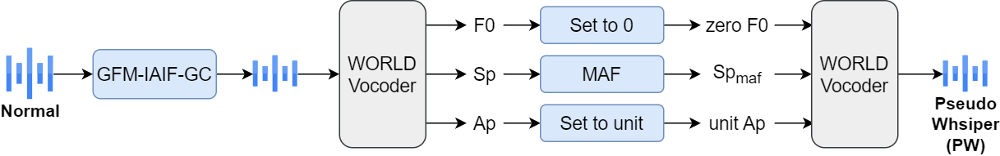

# Normal2Whisper
This is an implementation of our pseudo-whispered speech conversion method in the paper Improving Whispered Speech Recognition Performance using Pseudo-whispered based Data Augmentation ([pdf](https://arxiv.org/pdf/2311.05179.pdf); to appear in ASRU 2023).



## Dependencies
* Python 3.9 
* Numpy
* soundfile
* librosa
* [PyWorld](https://github.com/JeremyCCHsu/Python-Wrapper-for-World-Vocoder)

## Functions
1. `utils.py`

    This script has all the essential functions used in our proposed method.

    > **Note:** In our work, the speech files are or re-sampled to 16 kHz. So the parameter of GFM-IAIF-GC is based on this sample rate.

2. `data_gen.py`

    This script is used to convert normal speech into pseudo-whispered speech. 

3. `rq2_gen.py`

    This script is used to convert normal speech into: 
    1) normal speech without glottal contributions; 
    2) normal speech with widened formant bandwidth and shifted formant frequencies. 

## Usage
**1. Convert normal speech into pseudo-whispered speech from your dataset:**

```Bash
python data_gen.py --data_list './list_example(PATH TO THE LIST OF SOURCE TRAINING DATA)' \
                   --output_dir './data/training/wTIMIT/PW(PATH TO OUTPUT PW DIRECTORY)' 
```

**2. Convert normal speech into 1) normal speech without glottal contributions:**

```Bash
python rq2_gen.py --data_list './list_example(PATH TO THE LIST OF SOURCE TRAINING DATA)' \
                  --output_dir './data/training/wTIMIT/s1(PATH TO OUTPUT DIRECTORY)' \
                  --generating_mode '1'
```

**3. Convert normal speech into 2) normal speech with widened formant bandwidth and shifted formant frequencies:**

```Bash
python rq2_gen.py --data_list './list_example(PATH TO THE LIST OF SOURCE TRAINING DATA)' \
                  --output_dir './data/training/wTIMIT/s2(PATH TO OUTPUT DIRECTORY)' \
                  --generating_mode '2'
```

>**Note:** you can check `./list_example` to see an example of the input data list. You can get the list by using this command: 
>```Bash
>find ./corpora/wTIMIT/nist/TRAIN/normal/US/(PATH TO SOURCE TRAINING DATA) -name "*.WAV" | awk '{split($0,a,"/");split(a[14],b,"."); print b[1] ,$0}' > list
>```
>You may need to check your data directory and change `a[14]` in the command.

## Citation
```bibtex
@inproceedings{lin2023improving,
  title={Improving Whispered Speech Recognition Performance Using Pseudo-Whispered Based Data Augmentation},
  author={Lin, Zhaofeng and Patel, Tanvina and Scharenborg, Odette},
  booktitle={2023 IEEE Automatic Speech Recognition and Understanding Workshop (ASRU)},
  pages={1--8},
  year={2023},
  organization={IEEE}
}
```

## Contact
If you have any questions, feel free to open an issue or send me an email linzh (at) tcd.ie
